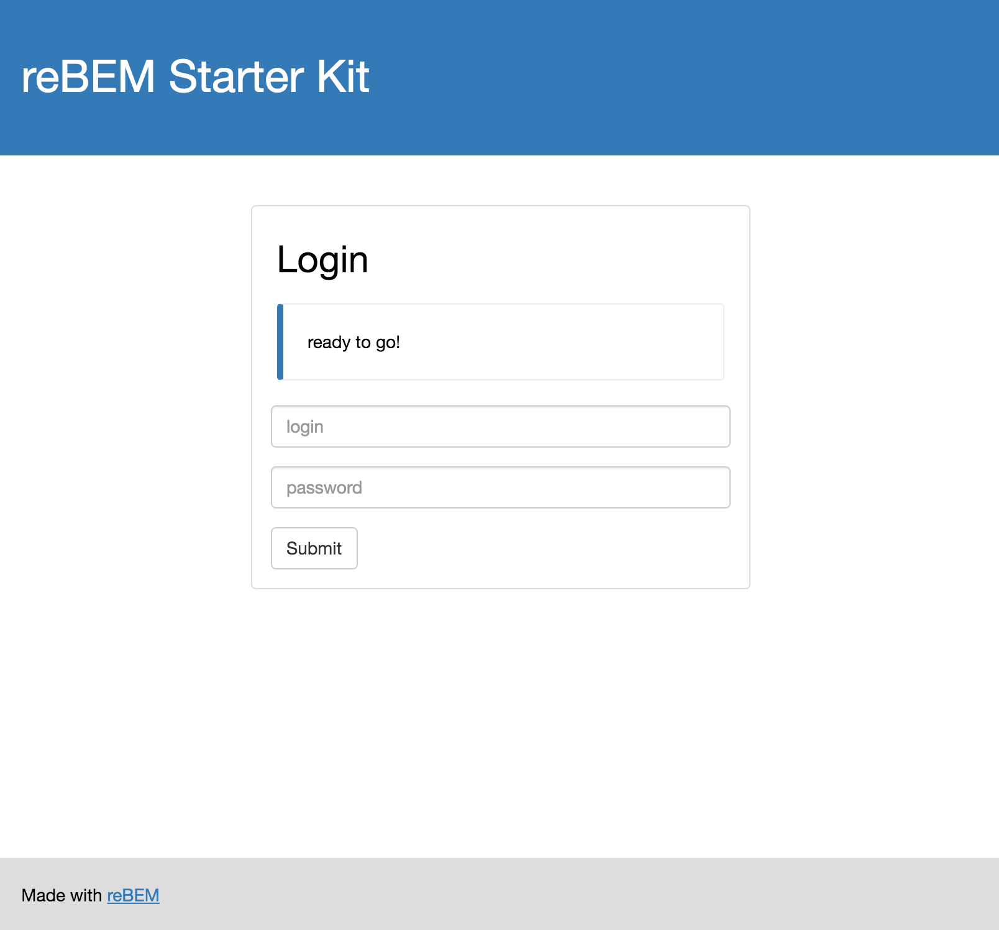

# reBEM Starter Kit

[](https://travis-ci.org/rebem/starter-kit)
[](https://gemnasium.com/rebem/starter-kit)

React starter kit based on [reBEM](https://github.com/rebem) stack.



## Structure

* `build/` – output folder
* `conf/` – configs
* `tasks.js` – [start](https://github.com/start-runner/start) tasks
* `src/index.js` – main entry point
* `src/components` – app [layer](#layers) components
* `src/theme-bootstrap` – bootstrap [layer](#layers) components
* `test` — tests

## Usage

### install

```
npm i
```

### dev

```
npm start dev
open http://localhost:3000/webpack-dev-server/
```

### build

```
npm start build
open build/index.html
```

### Layers

There are four [reBEM layers](https://github.com/rebem/layers-loader) in this starter kit:
1. [reBEM core components](https://github.com/rebem/core-components)
2. [reBEM reset theme](https://github.com/rebem/theme-reset)
3. Simple inline theme based on [Bootstrap 3](https://github.com/twbs/bootstrap). It'll give you the basic understanding on how to create your own themes.
4. App itself

Feel free to create and use your own.

## Testing

Tests are preconfigured with [karma](https://karma-runner.github.io/0.13/index.html), [mocha](https://mochajs.org/) and [chai](http://chaijs.com/). Testing stack also includes some useful helpers:
- [enzyme](https://github.com/airbnb/enzyme) — great testing library for React
- [rebem-enzyme](https://github.com/rebem/enzyme) — BEM addons for Enzyme
- [chai-bem](https://github.com/mistadikay/chai-bem) — Chai assertions for BEM class names

### run tests in TDD mode

```
npm start tdd
```

### run tests once

```
npm start test
```